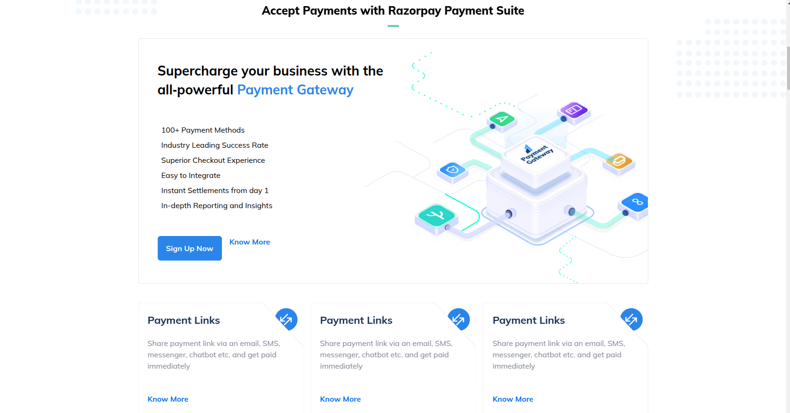
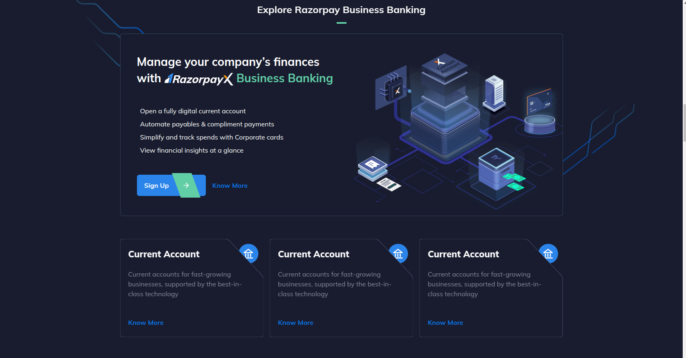
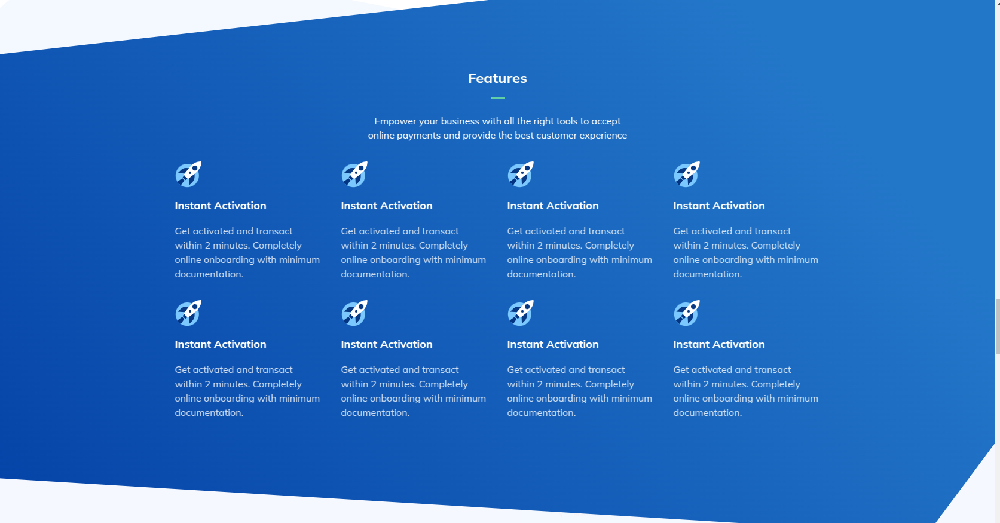
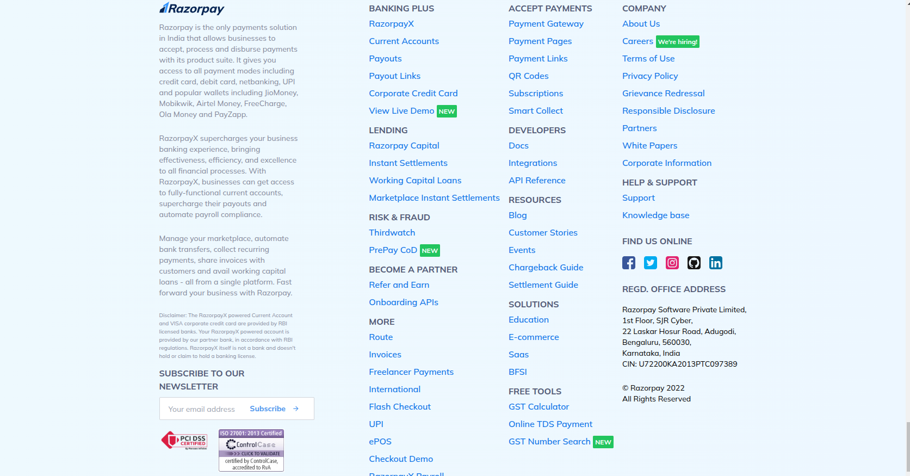

# 💸 RazorPayClone - Payment Gateway Frontend

## ✨ Overview
#### RazorPayClone is a stunning, pixel-perfect frontend clone of Razorpay's payment gateway interface, built with HTML and Tailwind CSS. This project meticulously recreates the sleek and intuitive user experience of Razorpay's payment system — without any backend functionality.

## 🚀 Features

- **Responsive Design**: Flawless experience across all devices 📱💻

- **Payment Form**: Clean, intuitive checkout experience 💳

- **Card Animations**: Smooth interactive elements for enhanced UX ✨

- **Multiple Payment Methods**: Credit/debit cards, UPI, wallets, and more 💳💸

- **Error States**: Visual feedback for form validation 🚫

- **Modern UI**: Sleek, professional interface that inspires trust 🤝

## 🖼️ Screenshots










## 🛠️ Technologies Used

- **`HTML5`**: Semantic markup for better accessibility 🌐

- **`Tailwind CSS`**: Utility-first framework for rapid UI development ⚡

- **`JavaScript`**: For interactive elements and form validation 💻

- **`Responsive Design`**: Mobile-first approach 📱

## 🔧 Installation & Setup

**1. Clone this repository**
```bash
git clone https://mailmeatdarshan.github.io/RazorPayClone/
```

**2. Install Tailwind CSS : (NOTE : Older Version - using the commands)**

> npm i -D tailwindcss@3 postcss autoprefixer vite

> npx tailwindcss init -p

**3. Now run it**
> npm run start

## 📝 Usage

This is a static frontend implementation, so you can:

- Navigate through different payment options 💳

- Fill out payment forms (no actual transactions occur) 💸

- Experience responsive design by resizing your browser 📱

- Use it as a reference for building payment interfaces 💡

## 🌟 Why I Built This
I created this project to demonstrate my frontend development skills, particularly with Tailwind CSS. Building a payment gateway interface requires:

- Attention to detail 🔍

- An understanding of user experience 💡

- The ability to create a trustworthy interface 💳

These are all crucial skills for a frontend developer.

## 🔍 Learning Outcomes

- Mastered Tailwind CSS utility classes for rapid development ⚡

- Improved responsive design techniques 📱

- Enhanced understanding of form validation UX ✅

- Practiced creating trust-inspiring financial interfaces 💰

## 🔮 Future Enhancements

- Add dark mode toggle 🌙

- Implement more animations and micro-interactions 🎬

- Create additional payment confirmation screens ✅

- Add localization support 🌍

## 👨‍💻 About Me
I'm a passionate frontend developer focused on creating beautiful, functional user interfaces. This project showcases my attention to detail and commitment to creating pixel-perfect implementations.

## 📄 License
This project is open source and available under the MIT License.

### 🙏 Acknowledgements

**Razorpay** for their inspiring design 💡

**Tailwind CSS** community for their excellent documentation 📚

**My mentor (Love Babbar)** and **peers** who provided feedback during development 🤝

# ⭐️ If you found this project interesting, please consider giving it a star! 🌟
## 📧 Questions or feedback? Reach out to me at mailmeatdarshan@gmail.com